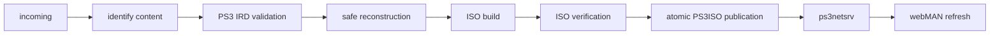

# PS3 Media Automation v0.2.3

Safe PS3 library ingest, IRD validation, ISO reconstruction, ps3netsrv/webMAN automation, and multi-indexer search tooling.

This open-source toolkit is for owners of legally obtained PS3 content who want to validate folder-format sources, repair only provable filename damage, build verified PS3 ISOs, publish them to a ps3netsrv library, and refresh webMAN safely. It also provides a search-only helper for indexers whose category capabilities differ.

## Quick start

```sh
git clone https://github.com/YOUR-ACCOUNT/ps3-media-automation.git
cd ps3-media-automation
cp examples/.env.example .env
# Edit .env with your own paths and optional endpoints.
docker compose up -d --build
```

Open `http://SERVER-IP:8787` and complete the first-run setup wizard. The application does not bundle game content, IRDs, firmware, Prowlarr, or a PS3; supply those separately and legally.

## v0.2 application

The browser Home page combines the daily workflow: PS3 search, active SAB PS3 downloads and ingest stages, then the ready ISO library. Administration remains on focused Jobs, IRDs, Doctor, Settings, and Logs pages. A background worker watches incoming content, waits for stable files, persists job state in SQLite, and routes PS3 folders through the existing fail-closed engine.

It is intentionally small and server-rendered. It never exposes credentials, auto-grabs search results, auto-launches games, reboots a PS3, or interrupts active gameplay. See [`docs/application.md`](docs/application.md) and [`docs/installation.md`](docs/installation.md).

## Features

- Immutable original input trees.
- Trusted IRD matching with file size and hash checks.
- Filename/path reconstruction only when an IRD hash and size prove a unique mapping.
- Collision refusal, scene-extra reporting, and fail-closed preflight.
- Pinned `makeps3iso` integration, SHA-256 output records, ISO structure checks, and atomic publication.
- Import support for PS3 folders/ISOs plus reusable PS1, PS2, PSP, and PKG routing.
- Read-only-library-friendly ps3netsrv publication.
- webMAN scan and relay-enforced, gameplay-safe XMB refresh with pending refresh handling.
- `ps3-search`, which sends a category-filtered query to a capable indexer and a category-less query to a broader indexer, then merges and deduplicates results. It never grabs a release.
- Read-only SAB PS3 queue monitoring with progress, speed, and ETA on Home.

## Requirements

- Linux host with Python 3.10 or newer.
- Sufficient storage for a separate reconstruction work tree and final ISO; large games may require tens of gigabytes.
- `makeps3iso` from a trusted, pinned `ps3iso-utils` release.
- A trusted IRD for each title that must be validated. IRDs are not included in this repository.
- Prowlarr if using search; direct HTTP and existing-container execution are both supported.
- ps3netsrv configured to expose the published library, preferably with the library bind mounted read-only in the server container.
- webMAN MOD on the PS3 and a Cobra-capable environment where NETISO mounting is used.
- A management relay for safe XMB reloads. The relay must determine whether a game is running and return HTTP 202 with `action=xmb-refresh-pending` instead of interrupting gameplay.

The runtime uses only Python's standard library. `pytest` is optional; the included tests can also be run directly with Python.

The reference build uses the official `ps3iso-utils` release `277db7de`
([source](https://github.com/bucanero/ps3iso-utils/releases/tag/277db7de));
the validated `makeps3iso` SHA-256 is
`c36fe8e6daf9c3ca3d617f79dc524a595aae4f178e52b314937f2fce5a9f48e4`.
Install that trusted binary separately and verify its checksum before use.

## Installation

```sh
git clone https://github.com/YOUR-ACCOUNT/ps3-media-automation.git
cd ps3-media-automation
cp examples/.env.example .env
# Edit .env with your own paths, IDs, endpoints, and secrets.
set -a; . ./.env; set +a
sudo install -o root -g root -m 0755 scripts/ps3_ingest.py /usr/local/sbin/ps3-ingest
sudo install -o root -g root -m 0755 scripts/ps3-import-incoming.py /usr/local/sbin/ps3-import-incoming
sudo install -o root -g root -m 0755 scripts/ps3-search.py /usr/local/sbin/ps3-search
sudo install -o root -g root -m 0755 scripts/ps3-refresh.py /usr/local/sbin/ps3-refresh
sudo install -o root -g root -m 0755 scripts/ps3ctl /usr/local/sbin/ps3ctl
```

Create the configured directories and give the download worker write access only to the incoming directory. Keep the published library read-only to ps3netsrv:

```sh
sudo install -d -m 0755 "$PS3_LIBRARY_ROOT" "$PS3_INCOMING_DIR" "$PS3_WORK_ROOT" "$PS3_STATE_ROOT" "$PS3_IRD_ROOT" "$PS3_ISO_ROOT"
sudo chmod 0755 "$PS3_INCOMING_DIR"
```

Source the private environment for interactive use or load it through your service manager. Do not commit `.env` or tokens.

## Configuration

See [`examples/.env.example`](examples/.env.example). The important settings are:

- `PS3_LIBRARY_ROOT`: root of the library published through ps3netsrv.
- `PS3_INCOMING_DIR`: download/import staging directory.
- `PS3_WORK_ROOT`: persistent, per-game reconstruction workspace; do not use `/tmp` for large games.
- `PS3_STATE_ROOT`, `PS3_IRD_ROOT`, and `PS3_ISO_ROOT`: audit/IRD/final ISO locations.
- `PS3_MAKEPS3ISO`: absolute path to the pinned trusted builder.
- `PS3_REFRESH_RELAY_URL`, `PS3_REFRESH_RELAY_TOKEN_FILE`, and `PS3_REFRESH_PENDING_FILE`: safe refresh integration. Never place the token in a repository file.
- `PROWLARR_SEARCH_URL`, `PROWLARR_CONTAINER`, and `PROWLARR_API_KEY`: Prowlarr API access. Leave the container value empty for direct HTTP. `PROWLARR_PUBLIC_URL` is the browser-reachable Prowlarr address used by result actions.
- `PROWLARR_PS3_INDEXER_ID` and `PROWLARR_PS3_CATEGORY`: indexer and category that actually advertise PS3, normally category 1080.
- `PROWLARR_NOCATEGORY_INDEXER_ID`: indexer that should receive the same query without categories.
- `SAB_URL`, `SAB_API_KEY`, and `SAB_CATEGORY`: optional read-only queue monitoring. The API key is sent in a POST body and never rendered.
- `PS3_CAPACITY_PATHS`: labeled configured storage paths used for filesystem capacity instead of container-overlay capacity.

Use generic IDs and names for other compatible indexers; do not assume every provider exposes the same raw category IDs.

## PS3 ingest

```sh
sudo ps3-ingest --check /path/to/source-folder
sudo ps3-ingest /path/to/source-folder
sudo ps3-ingest --ird /path/to/title.ird /path/to/source-folder
```

Preflight identifies the game, reads `PARAM.SFO`/disc metadata, inventories the full tree, and compares it with the matching IRD. A malformed filename is reconstructed only when the actual bytes have a unique expected IRD hash and size. Missing files, hash mismatches, executable mismatches, collisions, ambiguous mappings, and unavailable IRDs fail closed.

The input is never renamed, deleted, patched, or normalized. Proven repairs are made in a unique directory below `PS3_WORK_ROOT`; scene-only files are excluded there only when the audit proves they are not retail content. The builder writes a temporary image, validates its filesystem and important files, calculates SHA-256, and atomically publishes only after validation. Existing different ISO names are never overwritten.

Audits are stored below `PS3_AUDIT_ROOT` or its state-root default. A failed preflight preserves the source and records what is needed next.

## Importer

`ps3-import-incoming` scans `PS3_INCOMING_DIR`. PS3 folder candidates go through `ps3-ingest` and are never published as raw playable folders. Successful PS3 output goes to `PS3_ISO_ROOT`. PS1 BIN/CUE/ISO, PS2 ISO, PSP ISO, and PKG files retain separate destinations under the library. Sources are preserved; failures remain in incoming with a log/audit explaining the problem.

## PS3 search

```sh
ps3-search "search terms"
ps3-search "search terms" --limit 25
ps3-search "search terms" --json
```

One invocation performs two Prowlarr API searches. The configured PS3-capable indexer receives category `1080`; the configured fallback indexer receives no category filter. Returned objects retain title, indexer, age/date, size, categories, GUID, and other Prowlarr fields. Human output marks the source indexer, while `--json` retains the complete result objects. Obvious duplicates are removed by normalized title plus size. This command is search-only and never calls a grab/download endpoint. The Home action opens a scoped search in Prowlarr so the user remains in control of its configured download-client routing.

## webMAN and ps3netsrv

Point ps3netsrv at the library root and expose it to the PS3 as NET0. Mount the library read-only in the ps3netsrv container or service whenever another process performs writes. Publish final images below the configured `PS3_ISO_ROOT`, then refresh webMAN's game list.

`ps3ctl net-refresh` requests a scan only. `ps3ctl net-refresh-xmb` delegates the scan and XMB reload to the configured management relay. The relay must check PS3 state first: an idle XMB may be reloaded, but an active game must produce a pending response. The client records that pending state and does not reboot, stop a game, change security settings, or call a play endpoint.

## Setup wizard and Doctor

On first launch the browser redirects to Setup. Enter storage paths, the PS3 host, optional ps3netsrv and Prowlarr endpoints, and save. The wizard creates permitted directories and redirects to Doctor. Doctor reports PASS, WARNING, or FAIL with a plain-language fix. Missing external services are warnings/failures, not crashes.

## Directory layout and first game

The configured incoming directory is writable staging. `.iso-build-work` is persistent scratch space, `.ingest/irds` holds user-supplied IRDs and audits, and `PS3ISO` is the final read-only-facing library. Copy a legally obtained, complete folder source into incoming and wait for the job to reach READY. Review its audit, then mount the published ISO from Library and press X on the PS3; no automatic launch occurs.

## IRD setup

Use the IRDs page to upload a trusted `.ird`, or place one in the configured IRD directory. The matching TITLE_ID is discovered during preflight. An absent or contradictory IRD leaves the job in `WAITING FOR IRD`/`NEEDS ATTENTION`; the project never fabricates missing retail content and never redistributes IRDs.

## PS3/webMAN and ps3netsrv setup

Configure webMAN MOD with NET0 pointing to ps3netsrv and expose the final `PS3ISO` directory read-only to ps3netsrv. Set `PS3_IP`, `PS3NETSRV_HOST`, and port in the wizard. Use the optional relay in `scripts/ps3-refresh-relay.py` when a protected management endpoint is needed. Its explicit allow-list, token, positive idle marker, scan, and reload sequence preserves active gameplay.

## Prowlarr search setup

Set `PROWLARR_URL` and `PROWLARR_API_KEY` or enter them in Setup. Configure the existing `ps3-search` variables for one indexer advertising Console/PS3 `1080` and one compatible category-less fallback. Set `PROWLARR_PUBLIC_URL` to the address browsers can open. The UI and CLI merge/dedupe search results; selecting **Open in Prowlarr** does not grab automatically.

## CLI for advanced users

The browser is optional. `ps3-ingest --check`, `ps3-ingest`, `ps3-import-incoming`, `ps3-search`, `ps3-refresh`, and `ps3ctl` remain available for operators and troubleshooting. They use the same environment-driven paths as the worker.

## Pipeline



## Real-world pattern

A folder-format PS3 source contained many files whose bytes matched a trusted retail IRD but whose names had scene-added suffixes. The safe workflow reconstructed only the names proven by unique hash/size matches, excluded proven scene-only metadata from the work copy, built a verified ISO, and left the original source byte-for-byte unchanged.

This project does not provide game files, ISOs, IRDs, firmware, or instructions for obtaining copyrighted content.

## Troubleshooting

- **Missing IRD:** obtain a trusted matching IRD and pass `--ird`, or place it in the configured IRD cache. The build remains blocked until validation is possible.
- **Hash mismatch / modified EBOOT, SELF, or SPRX:** do not treat it as a rename; obtain a clean source or proven replacement. The tool fails closed.
- **Filename collision:** two source files map to one expected retail path. Resolve the source manually; no automatic overwrite is attempted.
- **Modified PARAM.SFO:** metadata changes are reported; a build requires the configured validation policy to establish that the intended retail tree is still unambiguous.
- **Incomplete dump:** missing required content stops publication and preserves the source.
- **Permission denied in incoming:** grant the download worker write permission to the incoming directory only; do not use `chmod 777` on the library.
- **ps3netsrv cannot see the ISO:** check the ps3netsrv bind path, read-only mount, ownership, and port, then refresh webMAN.
- **webMAN list is stale:** run scan-only first. Use the XMB action only through a relay that checks active gameplay; a running game should queue a pending refresh.
- **Indexer lacks PS3 categories:** configure that indexer as the category-less search leg. Never invent a provider category ID.

## Safety design

Inputs are immutable. Reconstruction occurs in a separate work tree. Only unique IRD-proven changes are applied, and all unresolved or ambiguous content fails closed. Temporary output is validated before atomic publication. Refresh automation never interrupts gameplay for an XMB reload.

Do not expose port 8787 directly to the public Internet. Bind it to a trusted LAN or place it behind an authenticated reverse proxy/VPN. The setup wizard is intended for first-run administration, and the Prowlarr key stays server-side.

## Contributing

Run the focused tests before submitting changes, keep examples sanitized, and never add real credentials, media, IRDs, logs, backups, or private infrastructure details. Please open an issue before large behavioral changes.

## License

MIT; see [`LICENSE`](LICENSE).

## Backup, upgrade, and restore

Back up the application state volume, IRD/audit directory, and library metadata before upgrading. Stop Compose, copy those directories to protected storage, pull the new source, rebuild, and start it again. Restore by stopping the app, replacing only verified state/library data, and starting the same version first. Never restore secrets into a public repository or replace an existing ISO without a validation record.

## Versioning

The source version is recorded in [`VERSION`](VERSION). v0.2 adds the browser application and Docker packaging while preserving the advanced CLI tools.
